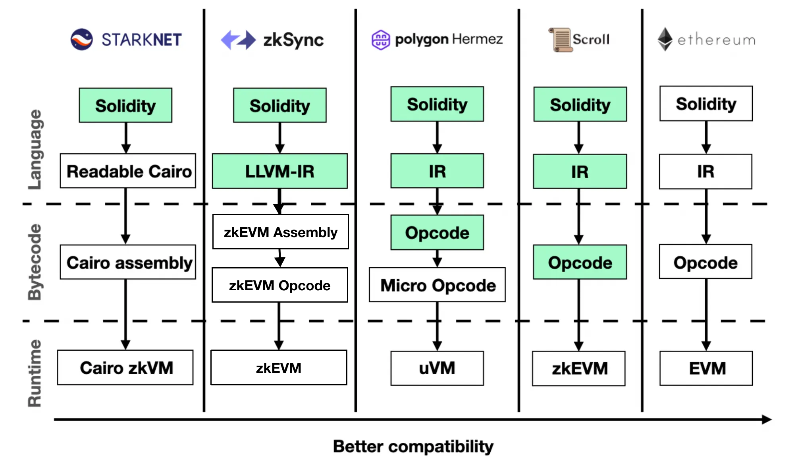
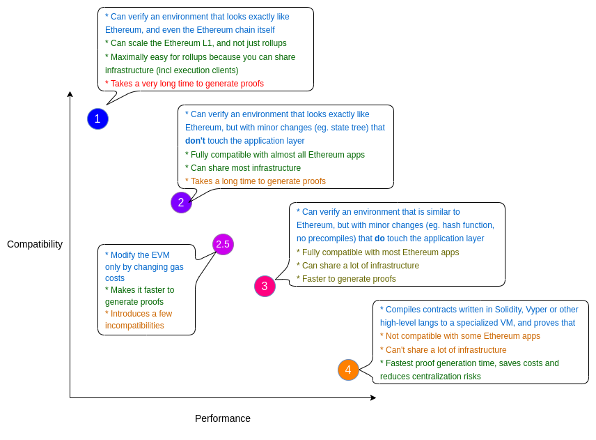

# WTF zkSync极简入门: 1. Layer 2 基础

这个系列教程帮助开发者入门 zkSync 开发。

推特：[@0xAA_Science](https://twitter.com/0xAA_Science)｜[@WTFAcademy_](https://twitter.com/WTFAcademy_)

社区：[Discord](https://discord.gg/5akcruXrsk)｜[微信群](https://docs.google.com/forms/d/e/1FAIpQLSe4KGT8Sh6sJ7hedQRuIYirOoZK_85miz3dw7vA1-YjodgJ-A/viewform?usp=sf_link)｜[官网 wtf.academy](https://wtf.academy)

所有代码和教程开源在 github: [github.com/WTFAcademy/WTF-zkSync](https://github.com/WTFAcademy/WTF-zkSync)

---

这一讲，我们将介绍什么是L2，以及它的种类。

## 1. 什么是 L2?

L2（Layer2，二层网络）是一种以太坊的扩容方案，它是一条独立的区块链，它扩展了以太坊并继承了以太坊的安全保证。

### 1.1 什么是 L1?

L1，也就是第一层网络，指的是底层区块链基础设施。它们是整个区块链生态系统的基石，为上层应用和扩展方案提供了必要的基础架构和安全保障。以太坊和比特币都是典型的第一层网络区块链，因为它们各自提供了一个独立运行的、具备完整功能的区块链系统，包括交易处理、数据存储、以及网络共识机制等。

L1网络的主要特点和功能包括：

- **节点操作员网络**：由全球分布的计算机或节点组成，这些节点负责维护和验证网络的交易和状态，保证网络的去中心化和安全。
- **区块生产者网络**：特定的节点（如矿工或验证者）负责生成新的区块，这些区块中包含了网络上进行的所有交易记录。
- **区块链本身及其交易数据历史记录**：区块链作为一个不断增长的链式数据结构，记录了从网络创始至今的所有交易和状态变更历史。
- **网络共识机制**：定义了网络中的节点如何达成一致，验证和确认交易，以及如何添加新的区块到区块链上。不同的L1网络可能采用不同的共识机制，如工作量证明（PoW）、权益证明（PoS）等。

### 1.2 不可能三角

在传统货币理论中存在“不可能三角”，即一国无法同时实现货币政策的独立性、汇率稳定与资本自由流动，最多只能同时满足两个目标，而放弃另外一个目标。

相类似，当前的区块链技术也存在“**不可能三角**”，即无法同时达到**可扩展（Scalability）**、**去中心化（Decentralization）**、**安全（Security）**，三者只能得其二。

- 可扩展性：每秒可以处理大量交易。
- 去中心化：拥有大量参与区块生产和验证交易的节点。
- 安全性：获得网络的多数控制权需要非常高昂的成本。

目前很多区块链会在三者中有所权衡，比如以太坊和比特币比较关心的就是去中心化和安全性。而有一些新公链更注重的是可扩展性和安全性。

从比特币创世开始，一直到以太坊网络中Crypto Kitties游戏的出现。主流公链项目最被人诟病的地方就是低下的TPS，以太坊当下的TPS完全无法给大多数应用提供实时稳定的支持，这与当前互联网行业动辄上万TPS的业务形成了鲜明的对比。

### 1.3 L2

L1网络之上的L2（第二层）解决方案，如卷叠（Rollups）和闪电网络（Lightning Network），通过在L1基础设施之上创建额外的协议或网络层，旨在提高交易处理速度、降低交易成本，并提升整个网络的可扩展性。

这些L2项目通过将交易数据发布到底层L1网络（如以太坊），利用L1网络的安全性和数据不变性，实现在L2层上的高效交易处理。此外，L1网络也为L2方案提供了数据可用性和最终的安全保障，使得在L2网络上进行的交易能够得到确认并在需要时回溯至L1网络验证。

## 2. Rollup

Rollup（卷叠）技术是目前最主流的L2扩容方案。顾名思义，Rollup就是把一堆交易卷起来（Rollup）汇总成一个交易，所有接收到这个交易的节点只去验证执行结果，而不会验证逻辑。因此Rollup交易所需Gas费会远小于交易Gas费总和，TPS（每秒钟交易次数）也增加了。

Rollup技术主要分为两类：

1.  Optimistic Rollup

Optimistic Rollup（乐观的Rollup协议）采用欺诈证明方法，即对链上发布的所有Rollup区块都保持乐观态度并假设其有效，它仅在欺诈发生的情况下提供证据。乐观Rollup的优势在于能使得原生Layer1上的solidity合约可以无缝移植到Layer2，从而最大程度提升了技术人员的研发体验，目前主流方案包括Optimism和Arbitrum。

2.  zk Rollup

zk Rollup 是基于零知识证明的Layer2扩容方案，采用有效性验证方法(VP)，默认所有交易都是不诚实的，只有通过有效性验证才会被接受。ZkRollup在链下进行复杂的计算和证明的生成，链上进行证明的校验并存储部分数据保证数据可用性。

**从中长期来看，随着 ZK-SNARK 技术的改进，ZK rollups 将在所有用例中胜出**。— Vitalik Buterin

## 3. 零知识证明

**零知识证明(zero-knowledge proof)，简写为 ZKP**，最初由 S.Goldwasser、S.Micali 及 C.Rackoff 在 1985 年的论文《交互证明系统的知识复杂性》提出，**指的是证明者能够在不向验证者提供任何有用信息的情况下，使验证者相信某个论断是正确的。**

**性质**

- 完备性：只要论断是正确的，证明者就可以让验证者相信论断。即：真的假不了。
- 合理性：如果论断是错误的，那么作弊的证明者无法让验证者相信论断。即：假的真不了。
- 零知识性：协议的交互仅仅揭露论断正确与否，而没有泄露任何其他的信息。

**零知识证明有何应用？**

- 证明关于隐私数据的声明
  - 在不暴露账户余额的情况下证明某人的账户余额多于一个亿，FTX。
  - 在不暴露DNA数据的情况下匹配DNA
- 匿名认证
  - 在不揭露身份的情况下证明请求者具有访问某些资源的权限
  - 证明某个人隶属于某个身份组而不暴露是哪个
- 匿名支付
  - 纳税而不透露收入
- 外包计算
  - 以太坊扩容技术ZK-Rollup就可以理解为一种外包计算，将计算过程放到链下进行，将结果放到链上去验证

## 4. zk Rollup 的 EVM 兼容性

ZK-Rollup早期为人诟病的地方是不能兼容 EVM，不能支持智能合约功能，例如早期 Gitcoin 捐赠主要支付途径的 zkSync 1.0 （Lite）仅能支持转账等基本功能。同时，由于不同 ZK 应用有各种专用电路，无法相互调用，可组合性差。因此市场急需能够支持以太坊智能合约的ZK-Rollup，而其中关键门槛就是能够支持零知识证明的虚拟机。随着引入 EVM 兼容的 zkVM，zk-rollups 才开始支持以太坊 dApps。

 Credit:Zhangye@scroll

由于 zkEVM 并没有统一的设计标准，所以每个项目方基于不同角度在兼容 EVM 和支持 ZK 之间权衡设计出各自方案，目前基本分为两种思路：

1. 编程语言层面支持，自定义 EVM 操作码，把 ZK-friendly 的操作抽出来重新设计新的、架构不同的虚拟机，通过编译器将 Soilidity 编译成新的虚拟机操作码
2. 字节码层面支持，支持原生 EVM 操作码

对于第一种策略，由于不受原有 EVM 指令集的约束，可以更灵活的将代码编译成对零知识证明更友好的指令集，同时也摆脱了兼容所有 EVM 原有指令集所需要的艰巨而繁重的工作。

对于第二种策略，由于完全支持了 EVM 现有的指令集，其使用的是和 EVM 一样的编译器，因此天然就对现有的生态系统和开发工具完全兼容，同时还更好的继承了以太坊的安全模型。

第一种思路更灵活，工作量更小，但需要花费额外精力在适配上；第二种思路工作量相对来说会大一些，但是兼容性更好，安全性更高。

在 Vitalik 的博文中，他将 zkEVM 分为几种类型。其中，类型 1 是直接在以太坊上面直接开发 zkEVM，这个开发过于复杂而且目前效率太低，以太坊基金正在研究中。类型 2、类型 2.5 和类型 3 是 EVM 等效的 zkEVM，Scroll 和 Polygon Hermez 目前处于类型 3 这个阶段，朝着类型 2.5 乃至类型 2 努力。类型 4 是高级语言兼容的 zkEVM，包括 zkSync 和 Starknet。这些类型并无好坏之分，而且 zkEVM 也没有统一的标准。

**从理论上讲，以太坊不需要为 L1 使用单一的 zkEVM 实现进行标准化；不同的客户可以使用不同的证明，因此我们继续从代码冗余中受益。**— Vitalik Buterin

## 5. 总结

这一讲，我们介绍了Layer 2 (L2)基础知识及其在以太坊扩容中的作用。特别的，我们介绍了主流的rollup技术，并着重介绍了zk rollup和zkEVM。下一讲，我们将详细介绍zkSync Era二层网络。
