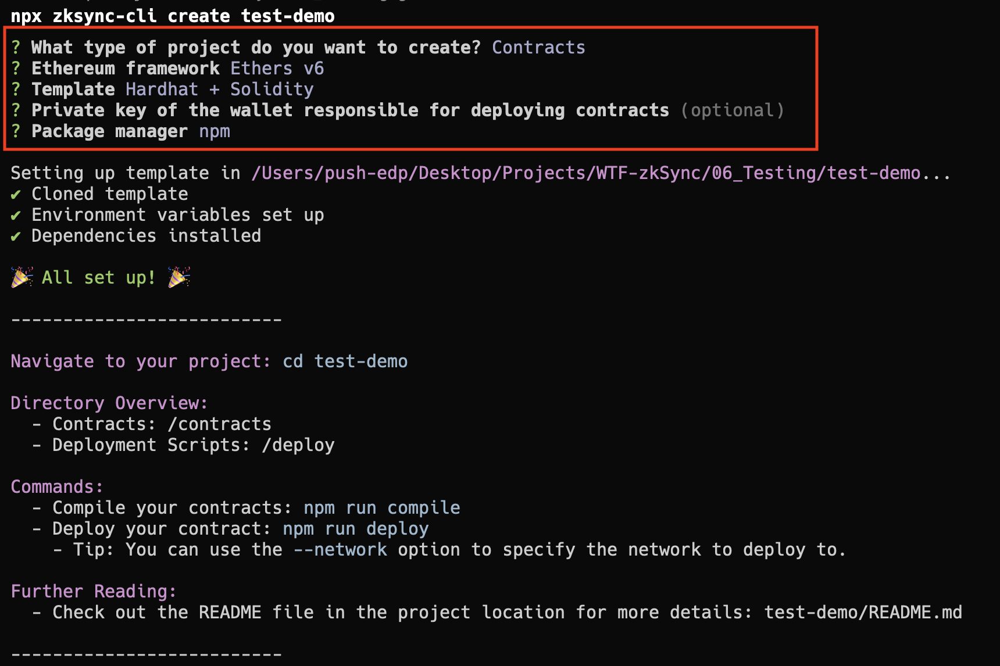
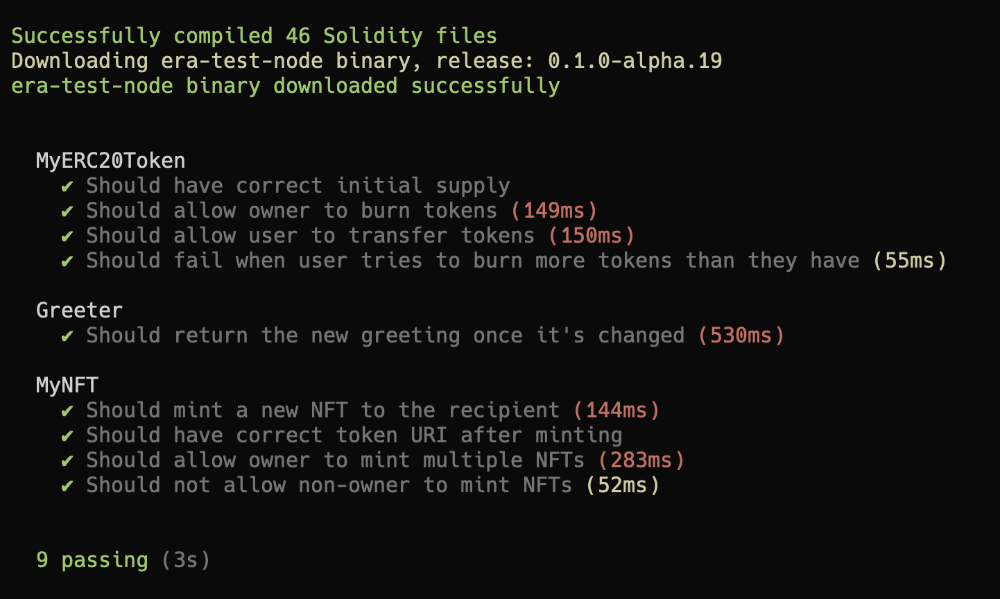

# WTF zkSync极简入门: 5. 合约测试

这个系列教程帮助开发者入门 zkSync 开发。
推特：[@0xAA_Science](https://twitter.com/0xAA_Science)｜[@WTFAcademy_](https://twitter.com/WTFAcademy_) 社区：[Discord](https://discord.gg/5akcruXrsk)｜[微信群](https://docs.google.com/forms/d/e/1FAIpQLSe4KGT8Sh6sJ7hedQRuIYirOoZK_85miz3dw7vA1-YjodgJ-A/viewform?usp=sf_link)｜[官网 wtf.academy](https://wtf.academy) 所有代码和教程开源在 github: [github.com/WTFAcademy/WTF-zkSync](https://github.com/WTFAcademy/WTF-zkSync)

---
在开发 zkSync 合约时，编写测试程序是验证合约逻辑正确性的关键一环。这一讲将引导你了解如何在 zkSync 中编写测试程序。

## 准备工作

在开始zkSync的测试之前，先来了解下evm智能合约的基础测试，请确保你已经配置好了测试环境。你需要安装 Node.js、NPM 以及[Hardhat](https://hardhat.org/hardhat-runner/docs/getting-started)，这是一个以太坊开发环境，能够让你编译、部署和测试你的智能合约。

如果你还没有安装 Hardhat，可以通过以下命令安装：

```shell
npm install -D hardhat
```

接下来，创建一个新的 Hardhat 项目：

```shell
npx hardhat
```


按照提示完成项目设置后，你的工作目录下会自动生成一些新目录，比如：`contracts`, `test`。你的基础开发环境就准备完成了。

## 编写智能合约

在 `contracts` 文件夹中创建一个新的 Solidity 智能合约文件 `MyContract.sol`。这里，我们将简单地编写一个存储和更新数字的合约作为例子：

```solidity
// SPDX-License-Identifier: MIT
pragma solidity ^0.8.0;

contract MyContract {
    uint public myNumber;

    function setMyNumber(uint _myNumber) external {
        myNumber = _myNumber;
    }

    function getMyNumber() external view returns (uint) {
        return myNumber;
    }
}
```

## 编写测试程序

测试编写的智能合约是保证其按预期工作的重要步骤。Hardhat 使用 Mocha 测试框架和 Waffle 断言库来编写测试。在 `test` 文件夹中，创建一个新的测试文件 `MyContract.test.js`。

```javascript
const { expect } = require("chai");
const { ethers } = require("hardhat");

describe("MyContract", function () {

    it("Should return the new number once it's changed", async function () {
        const MyContract = await ethers.getContractFactory("MyContract");
        const myContract = await MyContract.deploy();
        await myContract.waitForDeployment()

        const setTx = await myContract.setMyNumber(7);

        // 等待交易完成
        await setTx.wait();

        expect(await myContract.getMyNumber()).to.equal(7);
    });
});
```

这段测试代码初看可能有些复杂，但其步骤可以简单分为：
1. 部署合约。
2. 调用 `setMyNumber` 函数更新状态。
3. 等待函数调用在`hardhat`模拟的链环境中运行完成。
4. 调用`getMyNumber`来获取最新值，检查是否如我们所预期，`expect`方法是 [chai](https://www.chaijs.com/api/) 提供的辅助方法，详细使用方法请查阅它的文档。

## 执行测试

一切准备就绪后，你可以通过运行以下命令来执行测试：

```shell
npx hardhat test
```

当测试顺利通过时，你会看到一个绿色的复选框以及测试通过的信息，表明你的合约按预期工作。


## zkSync相关测试

### 准备工作

在zkSync测试中，你需要用到`zksync-cli`命令，在第一次使用这个命令时它会问你是否要安装，回答`y`即可。


我们将用这个命令来启动一个本地的zkSync的运行环境，包括一个临时的zkSync`In-Memory`节点，这个节点的运行需要依靠`docker`，所以你本地必须提前安装好了`docker`，[下载安装](https://www.docker.com/products/docker-desktop/)。 (`docker`是一种应用容器，你是第一次接触到它的话，就把它看成虚拟机就行，不需要深入，因为`zksync-cli`命令会帮我们屏蔽掉使用细节，有兴趣的朋友，可以自行探索 [docker](https://www.docker.com))


### 启动测试环境

在确保docker在正常运行后，使用`npx zksync-cli dev start`命令来启动一个运行环境，启动节点类型选择`In-Memory`节点，不需要添加任何附加模块。


第一次启动时会先创建一个docker镜像，等待运行完成即可，运行完后你的临时节点将在后台运行，你会得到一个本地zkSync链的RPC连接地址


### 创建测试

使用`npx zksync-cli create test-demo`命令可以创建一个名为`test-demo`的模板测试项目，命令运行时会询问你要测试类型和要用到的框架，按照自己喜好选择就行了。



这里我将选择`npm`作为项目的依赖管理器，使用`HardHat` + `Solidity`进行开发测试, `ethers`库我选择了v6版本。

在`test-demo`目录下，你会看到很多新的文件夹，和之前的基础测试一样，合约代码文件都在`contracts`目录下，需要运行的测试都在`test`目录下。

接下来运行以下两行命令来安装好项目依赖的第三方库，和额外添加一个zkSync数据的测试工具包

```
npm install
npm install -D @matterlabs/hardhat-zksync-chai-matchers @nomicfoundation/hardhat-chai-matchers @nomiclabs/hardhat-ethers
```

然后在`hardhat.config.ts`文件头中还需要添加下面这行代码，用来给chai添加对zkSync的支持。

```
import "@matterlabs/hardhat-zksync-chai-matchers";
```

最后运行`npm test`来启动测试，`test`目录下的测试文件都将被运行。（第一次启动时会下载`zksolc`和`solc`，若等待下载太久请自行解决网络问题)




## 总结

编写测试程序是智能合约开发中的重要一环，尤其是当你的合约逻辑变得复杂时。本教程简单介绍了如何在 zkSync 合约开发环境中编写和执行测试。实践中，你可能会需要编写更多的测试用例以覆盖各种场景，确保合约的健壮性。
